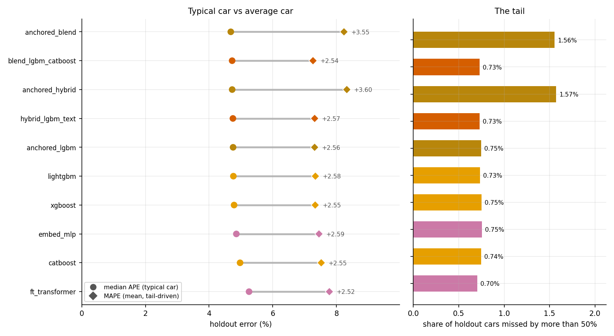
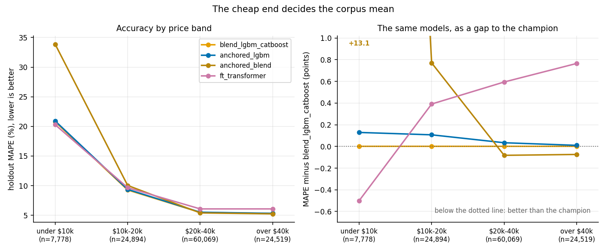
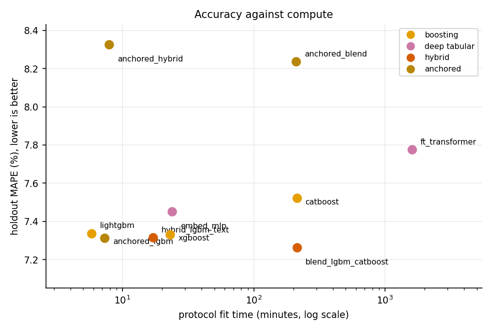
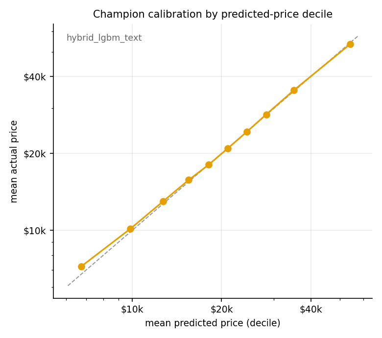

# AppraiseNet

**Calibrated used-vehicle price estimation: classical, deep and hybrid learners compared
under the AppraiseNet Evaluation Protocol, wrapped in a production learning loop.**

[](https://github.com/rhs2/appraisenet/actions/workflows/ci.yml)
[](LICENSE)
[](pyproject.toml)
[](https://github.com/astral-sh/ruff)

**Project page:** [rhs2.github.io/appraisenet](https://rhs2.github.io/appraisenet/) ·
**Paper:** [PDF](https://rhs2.github.io/appraisenet/Sium_Finstuen_2026_AppraiseNet.pdf?v=944b6263) · [read online](https://rhs2.github.io/appraisenet/paper.html)

AppraiseNet asks a question every applied pricing team faces: *which learning approach
actually prices cars best, how does the answer change when the corpus grows 30-fold, and
how honest can the uncertainty be?* It answers in two tiers: a **pilot study** of the
full 13-model zoo on 38,758 listings, and a **corpus-scale study** of every model that
can ride the full **1,174,659-listing corpus** on a single machine, both under the
**AppraiseNet Evaluation Protocol (AEP)** with distribution-free 80% prediction
intervals for every model, plus the full production machinery (versioned registry,
promote-or-rollback retraining, drift monitoring, serving API, IaC) that turns the
winner into a system.

**What thirty times the data changed.** The pilot's champion won by reading the listing
description; at corpus scale usable text survives on under 3% of listings and that
advantage falls from 0.49 to 0.024 MAPE points, while a fold-fitted **anchor ladder**,
which every listing supports, buys the same accuracy and lands statistically tied with
it. The leaderboard also stops being a total order: the anchored blend holds the **best
median error in the field and the worst mean**, because bounding a residual around a
group anchor traps the cheapest cars above their price. And the differences that survive
a bootstrap on 117,260 cars are small enough that compute matters more than rank, so
production deploys the second-place configuration at 1/29th of the champion's fit time.
The paper works all three through.

<!-- RESULTS:BEGIN -->
## Results

**1,174,659 real listings (1,057,399 train / 117,260 holdout)**, protocol as below; champion: **blend_lgbm_catboost** at **7.263% holdout MAPE** (median 4.724%, 78.948% of cars within 10%).

The leaderboard is not a total order: by **median** APE the best model is **anchored_blend** (4.682% against 4.724%), which is also the worst model by MAPE (8.236%). MAPE is a mean and belongs to the tail; the error profile below separates the two.

| model | family | CV MAPE | holdout MAPE | 95% CI | median APE | within 10% | 80% interval coverage | width (% of price) |
|---|---|---|---|---|---|---|---|---|
| blend_lgbm_catboost | hybrid | 7.268% | **7.263%** | 7.204-7.321% | 4.724% | 78.948% | 80.1% | 20.8% |
| anchored_lgbm | anchored | 7.313% | **7.314%** | 7.255-7.374% | 4.754% | 78.604% | 80.1% | 21.0% |
| hybrid_lgbm_text | hybrid | 7.322% | **7.315%** | 7.256-7.375% | 4.748% | 78.753% | 80.1% | 21.0% |
| xgboost | boosting | 7.324% | **7.332%** | 7.273-7.393% | 4.785% | 78.782% | 80.1% | 20.9% |
| lightgbm | boosting | 7.341% | **7.338%** | 7.279-7.4% | 4.763% | 78.625% | 80.1% | 21.0% |
| embed_mlp | deep tabular | 7.498% | **7.451%** | 7.392-7.511% | 4.856% | 77.932% | 80.3% | 21.5% |
| catboost | boosting | 7.538% | **7.522%** | 7.462-7.582% | 4.973% | 77.57% | 80.1% | 21.7% |
| ft_transformer | deep tabular | 7.915% | **7.777%** | 7.718-7.838% | 5.255% | 75.833% | 80.4% | 23.0% |
| anchored_blend | anchored | 8.201% | **8.236%** | 8.145-8.331% | 4.682% | 78.516% | 80.1% | 21.1% |
| anchored_hybrid | anchored | 8.298% | **8.325%** | 8.232-8.42% | 4.725% | 78.152% | 80.2% | 21.4% |

The champion's lead is statistically significant: no other model's 95% paired-bootstrap MAPE-gap interval includes zero.

Production interval (conformalised quantile regression on the production configuration): **80.4% coverage** at a median width of 18.2% of price.

Across all 45 model pairs, 4 are statistically tied on the shared holdout (95% paired-bootstrap interval of the gap includes zero); `reports/pairwise_mape.csv` has every pair.

**The distribution behind the leaderboard** (`reports/error_profile.csv`):

| model | median APE | MAPE | within 5% | p90 | p99 | miss > 50% | share of total error from misses > 25% |
|---|---|---|---|---|---|---|---|
| blend_lgbm_catboost | **4.724%** | 7.263% | 52.232% | 15.397% | 43.373% | 0.729% | 21.488% |
| anchored_lgbm | **4.754%** | 7.314% | 51.925% | 15.505% | 43.336% | 0.747% | 21.885% |
| hybrid_lgbm_text | **4.748%** | 7.315% | 52.017% | 15.528% | 43.622% | 0.728% | 21.831% |
| xgboost | **4.785%** | 7.332% | 51.811% | 15.476% | 44.231% | 0.749% | 21.954% |
| lightgbm | **4.763%** | 7.338% | 51.894% | 15.571% | 43.754% | 0.732% | 21.946% |
| embed_mlp | **4.856%** | 7.451% | 51.135% | 15.754% | 44.399% | 0.754% | 22.248% |
| catboost | **4.973%** | 7.522% | 50.211% | 15.886% | 44.312% | 0.745% | 21.646% |
| ft_transformer | **5.255%** | 7.777% | 48.078% | 16.415% | 43.539% | 0.704% | 21.499% |
| anchored_blend | **4.682%** | 8.236% | 52.519% | 16.115% | 67.842% | 1.556% | 32.874% |
| anchored_hybrid | **4.725%** | 8.325% | 52.155% | 16.372% | 68.629% | 1.573% | 33.155% |

**Holdout MAPE by price band** (`reports/price_bands.csv`):

| band | n | blend_lgbm_catboost | anchored_lgbm | anchored_blend | ft_transformer |
|---|---|---|---|---|---|
| under $10k | 7,778 | 20.785% | 20.914% | 33.861% | 20.285% |
| $10k-20k | 24,894 | 9.263% | 9.37% | 10.033% | 9.654% |
| $20k-40k | 60,069 | 5.48% | 5.514% | 5.398% | 6.074% |
| over $40k | 24,519 | 5.31% | 5.32% | 5.236% | 6.075% |

**Holdout MAPE by segment (top models):**

| segment | n | blend_lgbm_catboost | anchored_lgbm | hybrid_lgbm_text | xgboost | lightgbm |
|---|---|---|---|---|---|---|
| under $10k | 7778 | 20.79% | 20.91% | 20.9% | 21.29% | 21.01% |
| $10k-20k | 24894 | 9.26% | 9.37% | 9.32% | 9.39% | 9.37% |
| $20k-40k | 60069 | 5.48% | 5.51% | 5.55% | 5.55% | 5.56% |
| over $40k | 24519 | 5.31% | 5.32% | 5.29% | 5.19% | 5.3% |
| age 0-3y | 61224 | 5.11% | 5.1% | 5.11% | 5.1% | 5.12% |
| age 4-10y | 43673 | 7.82% | 7.92% | 7.92% | 7.92% | 7.96% |
| age 11y+ | 12363 | 15.92% | 16.13% | 16.11% | 16.33% | 16.17% |
| 150k+ miles | 5064 | 17.17% | 17.3% | 17.37% | 17.82% | 17.42% |
| private seller | 197 | 19.55% | 19.79% | 20.84% | 18.71% | 21.0% |

<p align="center">
  <br>
  <br>
  <br>
  
  <br>
  
  <br>
  
</p>

<!-- RESULTS:END -->

### The pilot tier: the full zoo at 38,758 listings

The study's first edition ran all thirteen original models on the late-August corpus
snapshot (34,865 train / 3,893 holdout; evidence committed in `reports/pilot/`). The
champion was the text hybrid at 10.75% holdout MAPE, its lead statistically
significant; boosting followed within half a point, the deep tabular models within
1.6, and the classical baselines trailed by 2 to 8 points:

| model | family | holdout MAPE | median APE | within 10% |
|---|---|---|---|---|
| hybrid_lgbm_text | hybrid | **10.75%** | 7.34% | 62.4% |
| stack | hybrid | 11.02% | 7.58% | 61.1% |
| blend_lgbm_catboost | hybrid | 11.08% | 7.48% | 60.6% |
| xgboost | boosting | 11.19% | 7.59% | 60.6% |
| lightgbm | boosting | 11.24% | 7.63% | 60.6% |
| catboost | boosting | 11.58% | 8.05% | 58.2% |
| embed_mlp | deep tabular | 11.94% | 8.44% | 56.7% |
| ft_transformer | deep tabular | 12.36% | 8.90% | 54.7% |
| extra_trees | bagged trees | 12.88% | 8.54% | 55.6% |
| random_forest | bagged trees | 13.50% | 9.24% | 53.0% |
| knn_comparables | instance | 15.22% | 10.79% | 47.0% |
| ridge | linear | 18.94% | 14.18% | 37.7% |
| elasticnet | linear | 19.42% | 14.43% | 36.5% |

## The AppraiseNet Evaluation Protocol (why these numbers can be trusted)

- **One untouched holdout** (10%, fixed seed) scored exactly once per model; every other
  number is 5-fold cross-validation on the training partition.
- **Everything fitted is fitted per fold**: categorical vocabularies, imputation
  statistics, and the engineered trim-tier feature (a trim's price positioning within its
  model line) are re-learned on each fold's training rows, so no statistic ever sees the
  rows it is evaluated on.
- **Same folds, same features, same metric for every model.** Fixed, documented
  hyper-parameters per family: this is a comparison of families under equal conditions,
  not a tuning contest.
- **Intervals with a guarantee**: split-conformal calibration in log space from
  out-of-fold residuals gives every model an 80%-coverage interval by construction;
  the production champion additionally uses conformalised quantile regression (CQR)
  for adaptive widths.
- **Money metrics**: MAPE, median APE, R2 in log space, share of cars within 10%, and
  interval coverage/width, reported overall and on the slices where pricing models hide
  their weaknesses (cheap, old, high-mileage, private-party cars).
- **Differences are tested, not eyeballed**: every model predicts the same holdout cars,
  so a **paired bootstrap** (4,000 resamples of the shared holdout) puts a 95% confidence
  interval on each error, on each model's gap to the leader, and on **every one of the 45
  model pairs**. Models whose gap interval includes zero are reported as **statistically
  tied**; the study never claims a ranking the data cannot support.
- **Two summaries, not one**: the bootstrap is applied to the median APE as well as to the
  mean, because MAPE is a mean and therefore a statement about the tail. At corpus scale
  the two disagree about who is best, and `reports/error_profile.csv` keeps the whole
  distribution (percentiles, tolerance shares, tail weight and its direction) so the
  disagreement is readable rather than hidden.

The complete methodology, every hyper-parameter and formula included, is in
[docs/METHODS.md](docs/METHODS.md).

## The model zoo

| family | models |
|---|---|
| linear | ridge, elastic net (compact one-hot) |
| instance | k-nearest-neighbour comparables (the "find similar cars" baseline) |
| bagged trees | RandomForest, ExtraTrees |
| gradient boosting | LightGBM, XGBoost, CatBoost (native categorical handling) |
| deep tabular | entity-embedding MLP; compact FT-Transformer (both implemented in-repo, PyTorch) |
| hybrid | LightGBM+CatBoost blend; stacked ensemble (ridge meta-learner on inner-OOF); LightGBM + bounded TF-IDF text-residual model on the listing description |
| anchored | three production-faithful configurations: LightGBM seeded with fold-fitted group-median anchors (trim -> model/year window -> model line -> make+body) plus monotone mileage constraints; the anchored hybrid, which prices each car as its group anchor plus a learned, bounded residual (clip +-0.75 in log space) with an inner-OOF zip3 target encoding; and the anchored blend, which averages two residual engines (monotone LightGBM + CatBoost) in log space under the same bound |

The corpus-scale tier (`configs/default.yaml`) runs the ten configurations that scale
to 1.17M rows on one machine; the classical baselines whose memory or distance
computations grow quadratically (linear one-hot, k-NN, unbounded-depth bagged trees)
are represented by their pilot-tier results (`configs/pilot.yaml`), committed under
`reports/pilot/`.

## The data

1,174,659 US used-vehicle listings (dealer and private-party), collected from public
marketplaces and dealer websites during July and August 2026 and growing daily through
the ingest path, VIN-decoded specs, price band $2,000-$100,000, model year 1990+. The
corpus is **proprietary and not distributed**; identity (VINs, sellers, platforms,
precise locations, contact details) was stripped before it reached this project. It
also did not start clean: each raw record carried roughly **160 fields**, which
curation reduced to the 29 modeling columns through field triage, VIN-decode enrichment
against the free NHTSA vPIC decoder, junk-price and not-a-car removal, per-vehicle
deduplication, and a label-noise quarantine that keeps mispriced listings out of the
target. Two raw fields are deliberately excluded: the first asking price and the
derived price drop, which together with the price-cut count would hand a model the
label; the count of price cuts alone is kept as demand signal. `data/README.md` documents the schema and the full curation
pipeline. **The entire pipeline runs without it**:
a synthetic generator with the identical schema powers the tests, CI and any curious
reader (`APPRAISENET_DB` unset -> synthetic corpus, clearly labelled in every output).

Storage is a single URL. `APPRAISENET_DB` accepts a SQLite file path (zero-setup
default) or a **PostgreSQL DSN** for the production feed; every reader and writer goes
through `src/appraisenet/db.py`, so the backend is a one-line `.env` change. The corpus
grows day by day through `appraisenet data ingest --source <new.db|new.csv>`: incoming
rows pass the same quality gates as training, are fingerprinted on their identifying
fields, and only never-seen listings are appended. The ingest is idempotent by
construction, so a daily cron can never duplicate or dirty the corpus, and each run
of it is recorded in an
`ingest_log` table. Migrating SQLite -> Postgres is one ingest with the old file as the
source and the DSN as the destination.

## Production, not just a study

- `appraisenet train-production`: fits the production configuration + CQR calibration,
  stages it in a **versioned registry** (semantic versions; automatic retrains bump
  minor) with a **promote-or-rollback guardrail**: a candidate that scores worse than
  the serving model on the holdout is rejected, never silently deployed. Production
  serves the **anchored LightGBM** (group-median anchor ladder as features + monotone
  mileage constraints + CQR intervals): the study's overall champion leans on the
  listing description, which an API caller pricing a car from its specs does not have,
  so the deployed model is chosen for the inputs it will actually receive. Among the
  text-free configurations the anchored one is statistically tied with the text hybrid,
  0.025 MAPE points ahead of the plain booster it replaces, carries the monotonicity a
  pricing API should not violate in front of a user, and retrains in 7 minutes rather
  than 213. The staged artifact carries the fitted ladder next to the booster, and the
  serving path applies it to every request.
- `appraisenet serve`: FastAPI endpoint returning point price + calibrated interval;
  **hot-reloads** on promotion; logs every prediction.
- `appraisenet monitor`: population-stability drift report (features and predictions)
  over recent serving traffic, with warn/alert thresholds.
- MLflow tracking (SQLite by default, JSONL fallback that can be replayed), model cards
  per learner, pytest suite and GitHub Actions CI on the synthetic corpus, Docker +
  docker-compose, and Terraform for AWS (ECR, ECS Fargate behind an ALB, RDS Postgres,
  S3 artifacts, CloudWatch) under `deploy/aws/`.

## Quickstart

```bash
pip install -e ".[dev,tracking]"
appraisenet data check                      # synthetic corpus unless APPRAISENET_DB is set
appraisenet benchmark --config configs/smoke.yaml   # 4 models, ~2 minutes
appraisenet benchmark --config configs/default.yaml # the corpus-scale study
appraisenet benchmark --config configs/pilot.yaml   # the full zoo at pilot scale
appraisenet train-production && appraisenet serve   # POST /predict
pytest -q                                   # everything runs on synthetic data
```

## Repository map

```
configs/            experiment configurations (default = corpus scale, pilot, smoke)
src/appraisenet/    data, db, features, protocol, model zoo (models/), benchmark,
                    compare, evaluate, registry, serve, monitor, tracking, cli
docs/               METHODS.md, the GitHub Pages site (index, paper, PDF), result figures
paper/              IEEEtran manuscript: main.tex + generated tables; python paper/build.py
data/               schema + curation documentation (the corpus itself is never here)
models/             production registry (populated by train-production, never committed)
tests/              pytest suite (synthetic corpus only)
scripts/            README results updater, pre-push leak scan
reports/            results, comparison + pairwise stats, error profile, price bands,
                    segments, figures, model cards (generated); pilot/ holds the
                    38,758-listing tier's committed evidence
deploy/aws/         Terraform (ECR, ECS Fargate, ALB, RDS, S3) + deployment notes
```

## Citation

```bibtex
@misc{sium2026appraisenet,
  author       = {Sium, Rakibul Hasan and Finstuen, Drew},
  title        = {AppraiseNet: Calibrated Used-Vehicle Price Estimation with
                  Classical, Deep and Hybrid Learners},
  year         = {2026},
  howpublished = {Paper, project page and source code},
  url          = {https://rhs2.github.io/appraisenet/}
}
```

MIT licensed. The dataset is not part of the license.
