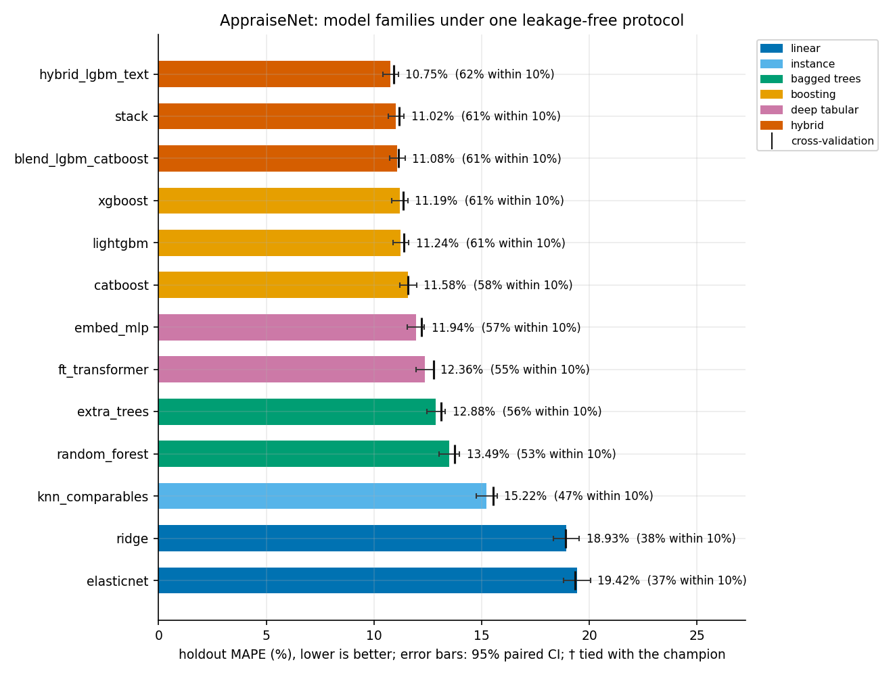
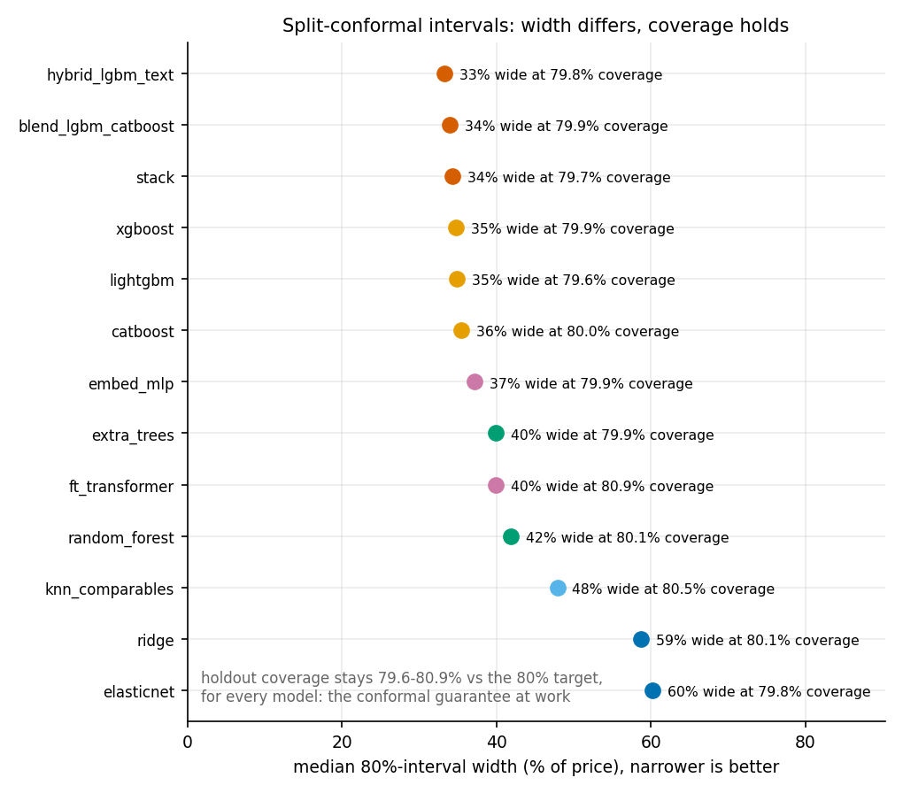
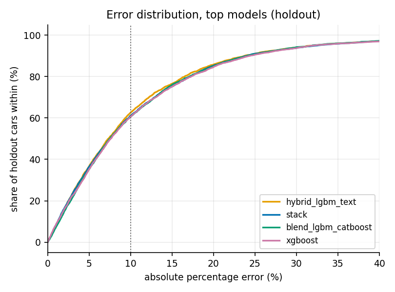
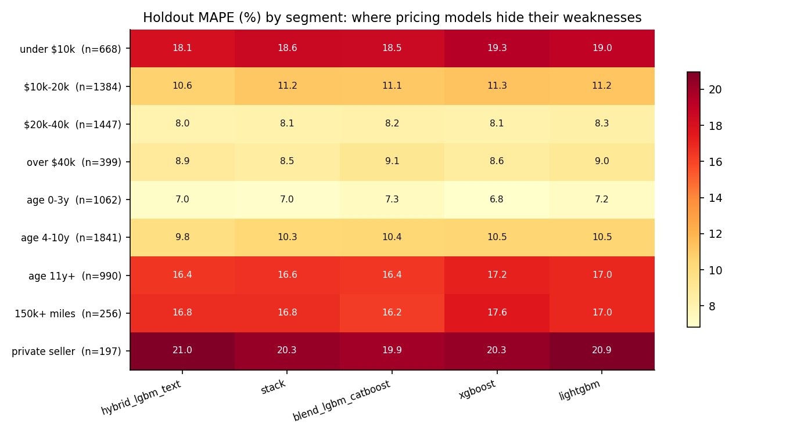

# AppraiseNet

**Calibrated used-vehicle price estimation: classical, deep and hybrid learners under one
leakage-free protocol, wrapped in a production learning loop.**

[](https://github.com/rhs2/appraisenet/actions/workflows/ci.yml)
[](LICENSE)
[](pyproject.toml)
[](https://github.com/astral-sh/ruff)

AppraiseNet asks a question every applied pricing team faces: *given ~39,000 real used-car
listings, which learning approach actually prices cars best, and how honest can its
uncertainty be?* It answers with a controlled comparison of six model families under a
single evaluation protocol, distribution-free 80% prediction intervals for every model,
and the full production machinery (versioned registry, promote-or-rollback retraining,
drift monitoring, serving API, IaC) that turns the winner into a system.

<!-- RESULTS:BEGIN -->
## Results

**38,758 real listings (34,865 train / 3,893 holdout)**, protocol as below; champion: **hybrid_lgbm_text** at **10.754% holdout MAPE** (median 7.335%, 62.445% of cars within 10%).

| model | family | CV MAPE | holdout MAPE | 95% CI | median APE | within 10% | 80% interval coverage | width (% of price) |
|---|---|---|---|---|---|---|---|---|
| hybrid_lgbm_text | hybrid | 10.906% | **10.754%** | 10.402-11.122% | 7.335% | 62.445% | 79.8% | 33.3% |
| stack | hybrid | 11.156% | **11.019%** | 10.655-11.395% | 7.577% | 61.058% | 79.7% | 34.3% |
| blend_lgbm_catboost | hybrid | 11.143% | **11.081%** | 10.715-11.449% | 7.481% | 60.57% | 79.9% | 34.0% |
| xgboost | boosting | 11.365% | **11.19%** | 10.811-11.571% | 7.59% | 60.622% | 79.9% | 34.8% |
| lightgbm | boosting | 11.399% | **11.243%** | 10.877-11.621% | 7.631% | 60.622% | 79.6% | 34.9% |
| catboost | boosting | 11.584% | **11.582%** | 11.191-11.977% | 8.046% | 58.181% | 80.0% | 35.5% |
| embed_mlp | deep tabular | 12.194% | **11.944%** | 11.551-12.336% | 8.438% | 56.666% | 79.9% | 37.2% |
| ft_transformer | deep tabular | 12.76% | **12.357%** | 11.953-12.763% | 8.897% | 54.688% | 80.9% | 39.9% |
| extra_trees | bagged trees | 13.108% | **12.877%** | 12.44-13.317% | 8.543% | 55.613% | 79.9% | 39.9% |
| random_forest | bagged trees | 13.733% | **13.495%** | 13.031-13.967% | 9.243% | 53.044% | 80.1% | 41.9% |
| knn_comparables | instance | 15.537% | **15.216%** | 14.736-15.715% | 10.788% | 47.007% | 80.5% | 47.9% |
| ridge | linear | 18.897% | **18.935%** | 18.342-19.526% | 14.178% | 37.683% | 80.1% | 58.7% |
| elasticnet | linear | 19.319% | **19.418%** | 18.791-20.041% | 14.433% | 36.501% | 79.8% | 60.2% |

The champion's lead is statistically significant: no other model's 95% paired-bootstrap MAPE-gap interval includes zero.

Production interval (conformalised quantile regression on the production configuration): **80.2% coverage** at a median width of 33.3% of price.

**Holdout MAPE by segment (top models):**

| segment | n | hybrid_lgbm_text | stack | blend_lgbm_catboost | xgboost | lightgbm |
|---|---|---|---|---|---|---|
| under $10k | 668 | 18.13% | 18.64% | 18.53% | 19.33% | 18.98% |
| $10k-20k | 1384 | 10.64% | 11.18% | 11.1% | 11.31% | 11.25% |
| $20k-40k | 1447 | 8.01% | 8.06% | 8.19% | 8.05% | 8.31% |
| over $40k | 399 | 8.86% | 8.51% | 9.09% | 8.61% | 8.96% |
| age 0-3y | 1062 | 7.01% | 6.96% | 7.31% | 6.82% | 7.23% |
| age 4-10y | 1841 | 9.85% | 10.33% | 10.39% | 10.49% | 10.48% |
| age 11y+ | 990 | 16.45% | 16.65% | 16.4% | 17.17% | 16.96% |
| 150k+ miles | 256 | 16.79% | 16.77% | 16.22% | 17.57% | 16.96% |
| private seller | 197 | 20.96% | 20.26% | 19.92% | 20.28% | 20.92% |

<p align="center">
  <br>
  
  <br>
  
</p>

<!-- RESULTS:END -->

## The protocol (why these numbers can be trusted)

- **One untouched holdout** (10%, fixed seed) scored exactly once per model; every other
  number is 5-fold cross-validation on the training partition.
- **Everything fitted is fitted per fold**: categorical vocabularies, imputation
  statistics, and the engineered trim-tier feature (a trim's price positioning within its
  model line) are re-learned on each fold's training rows, so no statistic ever sees the
  rows it is evaluated on.
- **Same folds, same features, same metric for every model.** Fixed, documented
  hyper-parameters per family: this is a comparison of families under equal conditions,
  not a tuning contest.
- **Intervals with a guarantee**: split-conformal calibration in log space from
  out-of-fold residuals gives every model an 80%-coverage interval by construction;
  the production champion additionally uses conformalised quantile regression (CQR)
  for adaptive widths.
- **Money metrics**: MAPE, median APE, R2 in log space, share of cars within 10%, and
  interval coverage/width, reported overall and on the slices where pricing models hide
  their weaknesses (cheap, old, high-mileage, private-party cars).
- **Differences are tested, not eyeballed**: every model predicts the same holdout cars,
  so a **paired bootstrap** (4,000 resamples of the shared holdout) puts a 95% confidence
  interval on each MAPE and on each model's gap to the champion. Models whose gap
  interval includes zero are reported as **statistically tied**; the study never claims a
  ranking the data cannot support.

The complete methodology, every hyper-parameter and formula included, is in
[docs/METHODS.md](docs/METHODS.md).

## The model zoo

| family | models |
|---|---|
| linear | ridge, elastic net (compact one-hot) |
| instance | k-nearest-neighbour comparables (the "find similar cars" baseline) |
| bagged trees | RandomForest, ExtraTrees |
| gradient boosting | LightGBM, XGBoost, CatBoost (native categorical handling) |
| deep tabular | entity-embedding MLP; compact FT-Transformer (both implemented in-repo, PyTorch) |
| hybrid | LightGBM+CatBoost blend; stacked ensemble (ridge meta-learner on inner-OOF); LightGBM + bounded TF-IDF text-residual model on the listing description |

## The data

38,758 US used-vehicle listings (dealer and private-party), collected from public
marketplaces during 2026, VIN-decoded specs, price band $2,000-$100,000, model year
1990+. The corpus is **proprietary and not distributed**; identity (VINs, sellers,
platforms, precise locations, contact details) was stripped before it reached this
project. It also did not start clean: each raw record carried roughly **160 fields**,
which curation reduced to the 26 modeling columns through field triage, VIN-decode
enrichment against the free NHTSA vPIC decoder, junk-price and not-a-car removal,
per-vehicle deduplication, and a label-noise quarantine that keeps mispriced listings
out of the target. `data/README.md` documents the schema and the full curation
pipeline. **The entire pipeline runs without it**:
a synthetic generator with the identical schema powers the tests, CI and any curious
reader (`APPRAISENET_DB` unset -> synthetic corpus, clearly labelled in every output).

Storage is a single URL. `APPRAISENET_DB` accepts a SQLite file path (zero-setup
default) or a **PostgreSQL DSN** for the production feed; every reader and writer goes
through `src/appraisenet/db.py`, so the backend is a one-line `.env` change. The corpus
grows day by day through `appraisenet data ingest --source <new.db|new.csv>`: incoming
rows pass the same quality gates as training, are fingerprinted on their identifying
fields, and only never-seen listings are appended. The ingest is idempotent by
construction, so a daily cron can never duplicate or dirty the corpus, and each run
of it is recorded in an
`ingest_log` table. Migrating SQLite -> Postgres is one ingest with the old file as the
source and the DSN as the destination.

## Production, not just a study

- `appraisenet train-production`: fits the production configuration + CQR calibration,
  stages it in a **versioned registry** (semantic versions; automatic retrains bump
  minor) with a **promote-or-rollback guardrail**: a candidate that scores worse than
  the serving model on the holdout is rejected, never silently deployed. Production
  serves the best **text-free** configuration (LightGBM + CQR): the study's overall
  champion leans on the listing description, which an API caller pricing a car from
  its specs does not have, so the deployed model is chosen for the inputs it will
  actually receive.
- `appraisenet serve`: FastAPI endpoint returning point price + calibrated interval;
  **hot-reloads** on promotion; logs every prediction.
- `appraisenet monitor`: population-stability drift report (features and predictions)
  over recent serving traffic, with warn/alert thresholds.
- MLflow tracking (SQLite by default, JSONL fallback that can be replayed), model cards
  per learner, pytest suite and GitHub Actions CI on the synthetic corpus, Docker +
  docker-compose, and Terraform for AWS (ECR, ECS Fargate behind an ALB, RDS Postgres,
  S3 artifacts, CloudWatch) under `deploy/aws/`.

## Quickstart

```bash
pip install -e ".[dev,tracking]"
appraisenet data check                      # synthetic corpus unless APPRAISENET_DB is set
appraisenet benchmark --config configs/smoke.yaml   # 4 models, ~2 minutes
appraisenet benchmark --config configs/default.yaml # the full study
appraisenet train-production && appraisenet serve   # POST /predict
pytest -q                                   # everything runs on synthetic data
```

## Repository map

```
configs/            experiment configurations (default, smoke)
src/appraisenet/    data, db, features, protocol, model zoo (models/), benchmark,
                    compare, evaluate, registry, serve, monitor, tracking, cli
docs/               METHODS.md (full methodology) + committed result figures
data/               schema + curation documentation (the corpus itself is never here)
models/             production registry (populated by train-production, never committed)
tests/              pytest suite (synthetic corpus only)
scripts/            README results updater, pre-push leak scan
reports/            results, comparison stats, segments, figures, model cards (generated)
deploy/aws/         Terraform (ECR, ECS Fargate, ALB, RDS, S3) + deployment notes
```

## Citation

```bibtex
@software{sium2026appraisenet,
  author = {Sium, Rakibul Hasan},
  title  = {AppraiseNet: Calibrated Used-Vehicle Price Estimation with Classical,
            Deep and Hybrid Learners},
  year   = {2026},
  url    = {https://github.com/rhs2/appraisenet}
}
```

MIT licensed. The dataset is not part of the license.
